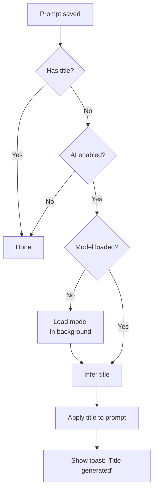
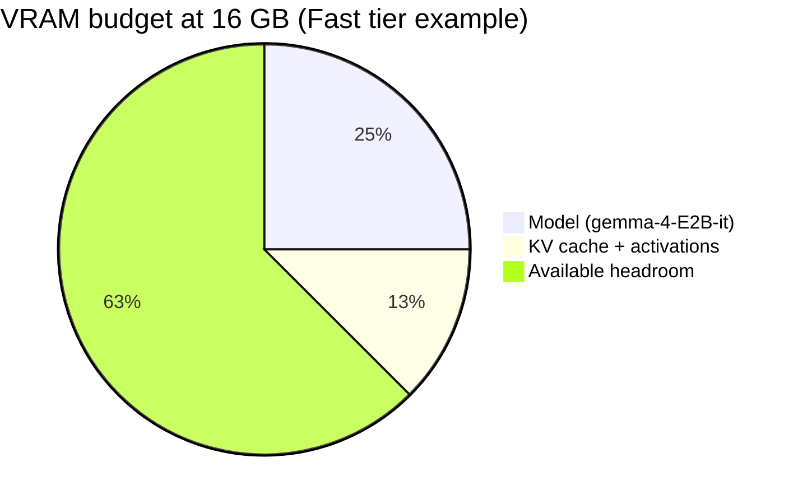
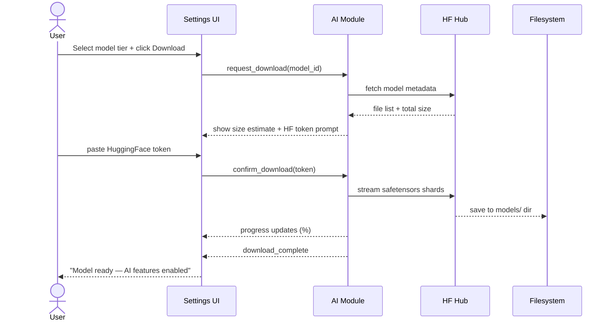
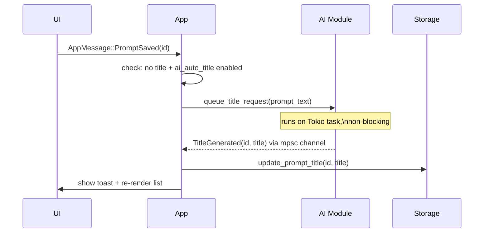

# AI Features Design

Design sketch for LLM-powered features in Prompt Quiver, using [candle](https://github.com/huggingface/candle) (HuggingFace's pure-Rust ML framework) with Gemma models.

---

## Goals

- Zero runtime dependencies for the user beyond the model file itself
- Opt-in: all AI features are disabled unless the user configures a model
- Non-blocking: inference runs async and never stalls the UI
- Cross-platform: Windows (CUDA or CPU), macOS Apple Silicon (Metal), Linux (CUDA or CPU)

---

## Feature 1: Auto-Titling

When a prompt is saved without a title, the app can automatically generate a short one using the local model.

### UX Flow

1. User finishes editing and saves (or navigates away from an untitled prompt)
2. App queues a titling request in the background — UI is immediately responsive
3. A subtle spinner or "…" appears in the title slot while inference runs
4. Title is applied and a toast notification appears: *"Title generated"*
5. User can edit or reject the title at any time (it's just a normal title edit)

### Trigger Logic



### Prompt Template

```
You are a concise assistant. Generate a short title (3–7 words) for the following prompt.
Output only the title — no quotes, no explanation.

Prompt:
{prompt_text}

Title:
```

Title is extracted from the first line of model output. If it exceeds ~60 characters or looks malformed, the result is discarded silently.

---

## Model Options

Three tiers, all Gemma instruct-tuned variants. The user picks a tier in Settings; the app handles download and loading.

| Tier | Model | VRAM (GPU) | Unified Memory (Apple Silicon) | Speed | Quality |
|------|-------|-----------|-------------------------------|-------|---------|
| **Fast** *(default)* | `google/gemma-4-E2B-it` | ~4 GB | ~4 GB | Very fast | Good for titling |
| **Balanced** | `google/gemma-4-E4B-it` | ~8 GB | ~8 GB | Moderate | Better for transforms |
| **Quality** | `google/gemma-3-12b-it` | ~12 GB (INT8) | ~12 GB | Slower | Best output quality |

**Notes:**
- The Fast tier fits comfortably within 16 GB VRAM on any tier; Quality tier is at the limit — both should fit on a typical RTX 4080/5070 or M3 Pro/Max with 18–36 GB unified memory
- Apple Silicon uses candle's Metal backend — no CUDA required
- CPU fallback is always available; Fast tier is usable on CPU (slow but functional for titling); Quality tier on CPU is impractical
- Gemma 4 models require accepting Google's terms on HuggingFace — a token is needed for the initial download

### VRAM Feasibility (16 GB ceiling)



---

## Model Download Flow

Models are downloaded from HuggingFace Hub using the `hf-hub` Rust crate and stored locally. The user never needs to visit HuggingFace manually.



**Storage location:** `{data_dir}/models/{model_id}/` (same root as the SQLite database, e.g. `~/.local/share/promptquiver/models/`)

**Resume support:** `hf-hub` checks existing files by hash before re-downloading shards.

---

## Settings Integration

New **AI** section in the Settings screen:

| Setting | Type | Default | Notes |
|---------|------|---------|-------|
| `ai_enabled` | bool | false | Master switch |
| `ai_model_tier` | enum Fast/Balanced/Quality | Fast | Drives model_id selection |
| `ai_model_path` | optional path | None | Override: point to a manually downloaded dir |
| `ai_auto_title` | bool | true | Enable auto-titling on save |
| `hf_token` | optional string | None | Stored in settings DB, used for gated downloads |

If `ai_model_path` is set, it takes precedence over the tier selection (power-user escape hatch).

---

## Architecture

### New module: `infra/src/ai/`

```
infra/src/ai/
  mod.rs          — AiEngine trait + ModelTier enum
  candle.rs       — CandleEngine: loads model, runs inference via candle + candle-transformers
  download.rs     — ModelDownloader: hf-hub integration, progress reporting
  titler.rs       — generate_title(prompt_text, engine) → Option<String>
```

`AiEngine` is a trait so tests can use a `MockAiEngine` that returns canned titles without loading any model.

### New dependencies (in `infra/Cargo.toml`)

```toml
[dependencies]
candle-core = { version = "0.9", optional = true }
candle-transformers = { version = "0.9", optional = true }
candle-nn = { version = "0.9", optional = true }
hf-hub = { version = "0.4", optional = true }
tokenizers = { version = "0.21", optional = true }

[features]
ai = ["candle-core", "candle-transformers", "candle-nn", "hf-hub", "tokenizers"]
ai-cuda = ["ai", "candle-core/cuda"]
ai-metal = ["ai", "candle-core/metal"]
```

Keeping AI behind a feature flag means the default build stays lean. CI can test the non-AI path without pulling in heavy ML deps.

### Message flow for auto-titling



This follows the same pattern as the existing git poller and file searcher — a background Tokio task sends results back to the main loop via an `mpsc` channel.

---

## Platform Matrix

| Platform | Backend | Requirement |
|----------|---------|-------------|
| Windows (NVIDIA 30xx/40xx) | CUDA | CUDA Toolkit 12.x, build with `ai-cuda` feature |
| Windows (NVIDIA 50xx Blackwell) | CUDA | CUDA 12.8+; candle sm_120 support is recent — verify |
| Windows (CPU only) | CPU | None beyond the model files |
| macOS Apple Silicon | Metal | Build with `ai-metal` feature; no GPU drivers needed |
| macOS Intel | CPU | No Metal support for Intel iGPU |
| Linux (NVIDIA) | CUDA | CUDA Toolkit 12.x, build with `ai-cuda` feature |
| Linux (CPU only) | CPU | None |

---

## Open Questions

1. **Blackwell CUDA:** candle's sm_120 (RTX 50xx) support is recently added and has had teething issues — needs hands-on verification before advertising CUDA support for 50-series.
2. **Tokenizer binary:** `tokenizers` crate links to a native Rust implementation but is heavy; benchmark compile time impact before committing.
3. **Model load time:** Loading even E2B on first use takes a few seconds. Should the app eagerly load on startup (if AI enabled) or lazily on first inference request? Lazy is simpler; eager avoids a stall on first auto-title.
4. **HF token storage:** Storing a HF token in the SQLite settings table is convenient but unencrypted. Consider using the OS keychain (`keyring` crate) or simply telling users to set `HF_TOKEN` env var.
5. **Gemma 4 Blackwell VRAM:** Gemma 4 uses new Effective Parameter architectures — actual VRAM figures above are estimates; measure against real hardware.
