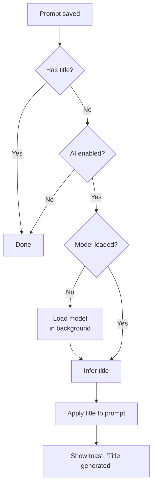
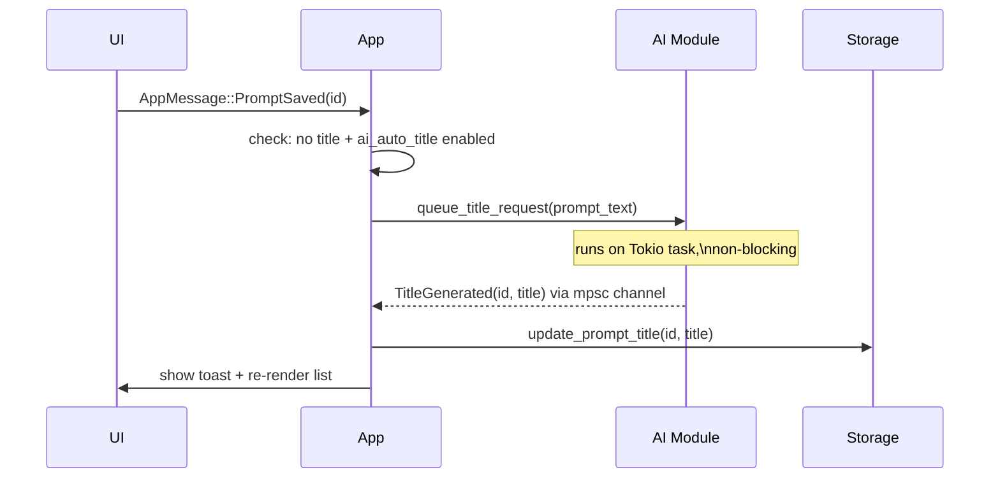

# AI Features Design

Design sketch for LLM-powered features in Prompt Quiver, using mistral.rs with Gemma 4 models.

---

## Goals

- Zero runtime dependencies for the user beyond the model file itself
- Opt-in: all AI features are disabled unless the user configures a model
- Non-blocking: inference runs async and never stalls the UI
- Cross-platform: Windows (CUDA or CPU), macOS Apple Silicon (Metal), Linux (CUDA or CPU)

---

## Feature 1: Auto-Titling

When a prompt is saved without a title, the app can automatically generate a short one using the local model.

### UX Flow

1. User finishes editing and saves (or navigates away from an untitled prompt)
2. App queues a titling request in the background — UI is immediately responsive
3. A subtle spinner or "…" appears in the title slot while inference runs
4. Title is applied and a toast notification appears: *"Title generated"*
5. User can edit or reject the title at any time (it's just a normal title edit)

### Trigger Logic



### Prompt Template

```
You are a concise assistant. Generate a short title (3–7 words) for the following prompt.
Output only the title — no quotes, no explanation.

Prompt:
{prompt_text}

Title:
```

Title is extracted from the first line of model output. If it exceeds ~60 characters or looks malformed, the result is discarded silently.

---

## Model Options

Three tiers, all Gemma instruct-tuned variants.

Note: for now, this is just an idea what to support, the app aims to just load the model in the path defined in settings.

| Tier | Model | VRAM (GPU) | Unified Memory (Apple Silicon) | Speed | Quality |
|------|-------|-----------|-------------------------------|-------|---------|
| **Fast** *(default)* | `google/gemma-4-E2B-it` | ~4 GB | ~4 GB | Very fast | Good for titling |
| **Balanced** | `google/gemma-4-E4B-it` | ~8 GB | ~8 GB | Moderate | Better for transforms |
| **Quality** | `google/gemma-4-26B-A4B-it` | ? | ? | Slower | Best output quality |

---

## Settings Integration

New **AI** section in the Settings screen:

| Setting | Type | Default | Notes |
|---------|------|---------|-------|
| `ai_enabled` | bool | false | Master switch |
| `ai_model_path` |  path | none (must define to enable model) |
| `ai_auto_title` | bool | true | Enable auto-titling on save |

---

### Message flow for auto-titling



---